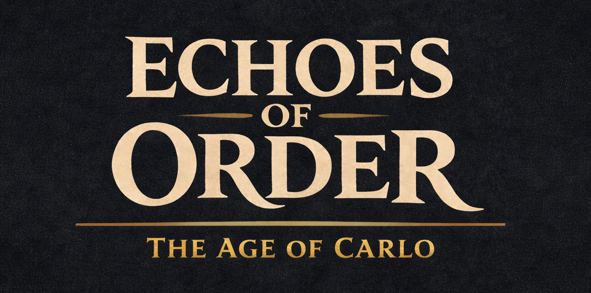

# Echoes of Order

Persistent world, **explicit authority**, replaceable simulations — long-term state before spectacle.

**Quick navigation:** [Architecture](architecture.md) · [Infrastructure](infrastructure.md) · [Current State](game-status.md) · [Current Work](current-work.md) · [Explorations](explorations/README.md) · [Devlogs](devlogs/README.md) · [Diagrams](diagrams.md) · [Project Goals](project.md) · [Gameplay Concepts](gameplay/README.md) · [About](about-me.md) · [For Sponsors](sponsor.md)

## Who This Documentation Is For

**Sponsors, engineers, and curious readers** who want a straight account of what Echoes of Order is, how it is wired, and what actually ships today. The docs favor trade-offs and pointers into the codebase over pitch decks.

## How to Read This Documentation

- **New here?** This README, then [Architecture](architecture.md) (who owns state, how simulations attach), then [Current State](game-status.md) (inventory of what runs).
- **Ops and deployment?** [Infrastructure](infrastructure.md) (stack, databases, **architecture poster**) and [Diagrams](diagrams.md) for flows.
- **Explorations and decisions?** [Current Work](current-work.md) for status; deeper summaries in [Explorations](explorations/README.md). Formal ADR-style material lives in the main repository under `docs/3_decisions`.
- **Shipped work in prose?** [Devlogs](devlogs/README.md) (migration stories, product-sized auth changes, etc.).

## What This Project Is

Echoes of Order is a **systems-driven MMO-shaped world**: rules and state first, not hand-scripted ride queues. The stack is treated as part of the design — realms isolate data, simulations stay swappable, and **correctness** matters more than early polish.

It is **not** a seasonal reset treadmill or a content-only theme park.

## What Kind of Game Is Echoes of Order?

**Format.** You play **persistent characters** in a shared world. Systems (combat, NPCs, simulation workers) generate outcomes; the world keeps history instead of rewinding per session.

**Play style.** You **inhabit a realm**. Combat, exploration, and tooling interactions are meant to leave traces — not flip back to a lobby state. Progression should feel **emergent** from those systems rather than from a single critical path.

**Tone.** Think **weight and continuity**: a world with its own logic, closer to the sustained fantasy of **World of Warcraft** than to arcade drop-in sessions. Not “fast filler MMO” — built for players who care that the stack **remembers**.

## Core Idea

Persistence is non-negotiable. Player, NPC, and system actions feed **history** and later state; they are not quietly discarded for convenience.

Three anchors:

- **Authoritative world state**
- **Deterministic simulation**
- **Consequences that outlive one login**

## World & Persistence

The world is split into **realms**. Each realm is a full authoritative instance: its own history, data, and live state. Inside a realm, NPCs and events stick around, systems drift forward in time, and players share one underlying world model. There is **no global wipe** design.

## Simulation Model

Gameplay logic runs in **non-authoritative simulations** (combat, movement, NPCs, local rules). They **never** own truth. The realm authority validates proposals, swaps workers when needed, and commits. That split is what keeps behavior consistent when pods fail or scale.

## Player Experience (Target State)

Design targets (not promises):

- Lasting effects from play
- Systems that push back instead of bending to convenience
- Progression that is **systemic**, not checklist-scripted

## Scope & Current State

Today the effort sits on **backend authority, realm isolation, and simulation plumbing**. Core realm/event/simulation pieces exist; a shippable player loop does not. Visuals and mass-market content are **explicitly** behind architecture.

**Metrics:** [Current State](game-status.md#by-the-numbers).

## What This Game Is Not

- Theme-park MMO built only on authored rides
- Fast seasonal reset product
- Short-session arcade loop
- Demo optimized for influencer clips over structure

The design space here is **slow-moving systems and structural integrity**.

## Why Build a Game Like This?

Most titles hide complexity behind resets and scripts. Echoes of Order asks what breaks if you treat the world like a **serious distributed system**: failures, recovery, and scale are design inputs, not post-launch surprises. The goal is **coherence**, not raw size.

## Support

How the project stays independent, why that matters, and where to donate: **[For Sponsors](sponsor.md#why-this-project-is-run-this-way)**.

## Status

Long-term **solo** project: no studio payroll, no investors pushing quarterly features. The architecture is real; the **playable surface** is still catching up.

No roadmaps for feature X by date Y. Decisions stay written down when they matter.

**Follow:** [Current Work](current-work.md), [Explorations](explorations/README.md), [Devlogs](devlogs/README.md), and the links under [For Sponsors](sponsor.md#how-to-follow-and-give-feedback).

## Documentation

| Document | Content |
|----------|---------|
| [Architecture](architecture.md) | Authority vs. simulation, realms, service map, HTTP/gRPC/Event Bus. |
| [Infrastructure](infrastructure.md) | k3s/Kubernetes, Helm, Envoy Gateway (Gateway API), cert-manager, DB layout, isolation, scaling. |
| [Current State](game-status.md) | What exists today vs. what does not; numeric snapshot. |
| [Current Work](current-work.md) | Active explorations, accepted/rejected items, milestones. |
| [Explorations](explorations/README.md) | Public summaries per topic (English). |
| [Devlogs](devlogs/README.md) | Narrative write-ups of shipped changes (edge, auth, …). |
| [Diagrams](diagrams.md) | Sequence diagrams (login, reconnect, layers, Event Bus, …). |
| [Project Goals](project.md) | Intent, design goals, audience. |
| [Gameplay Concepts](gameplay/README.md) | Feature concepts |
| [About the Developer](about-me.md) | Builder background and transparency stance. |
| [For Sponsors](sponsor.md) | Funding, principles, follow links. |

Full exploration prose lives in [Explorations](explorations/README.md). Decision records: main repo `docs/3_decisions`.

*Maintainability:* Metrics only in [Current State](game-status.md). Milestone narrative only in [Current Work](current-work.md). Devlog list only in [Devlogs](devlogs/README.md) (add new rows when publishing a devlog). Support/community URLs only in [For Sponsors](sponsor.md). Profile links only in [About the Developer](about-me.md).

## Key Terms

| Term | Meaning |
|------|--------|
| **Realm** | Isolated authoritative world instance: DB, event stream, simulation workers. No cross-realm game state. |
| **Authority / Realm Authority** | Single source of truth per realm. Validates all commits; simulations only propose. |
| **Simulation** | Replaceable worker for combat, NPCs, movement, local logic. Never owns durable state. |
| **Event Bus** | Pub/sub (e.g. NATS/JetStream) between Realm Core and simulations — no direct Realm ↔ sim coupling. |
| **Layer** | Shard of a zone (player cap). One simulation per layer; layers can merge or scale. |
| **Realm Core** | Authority service: sessions, gRPC + Event Bus to simulations, persistence. |
| **Realm Gateway** | Client edge: auth, realm routing, gameplay WebSocket. |
