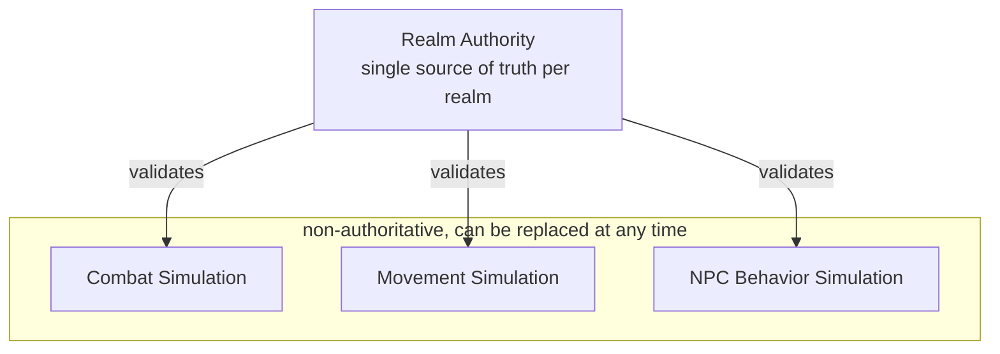
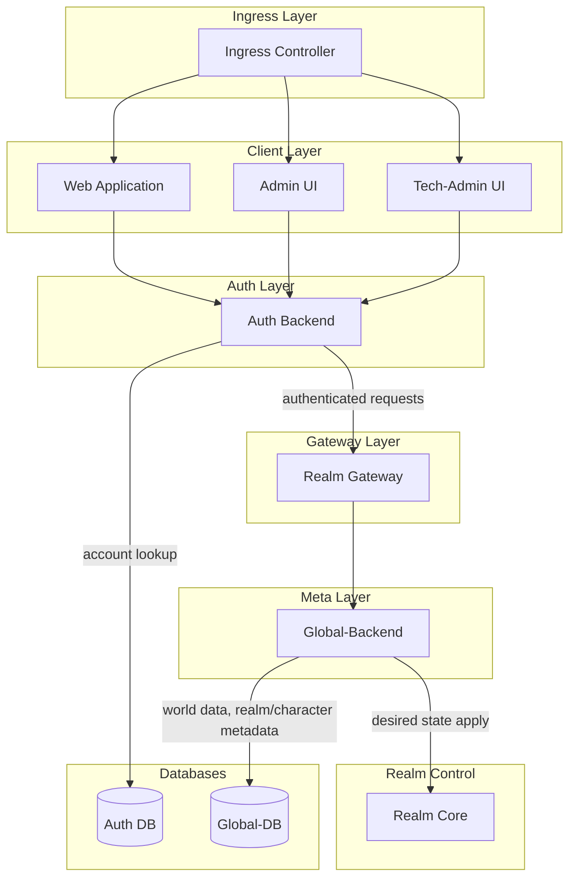
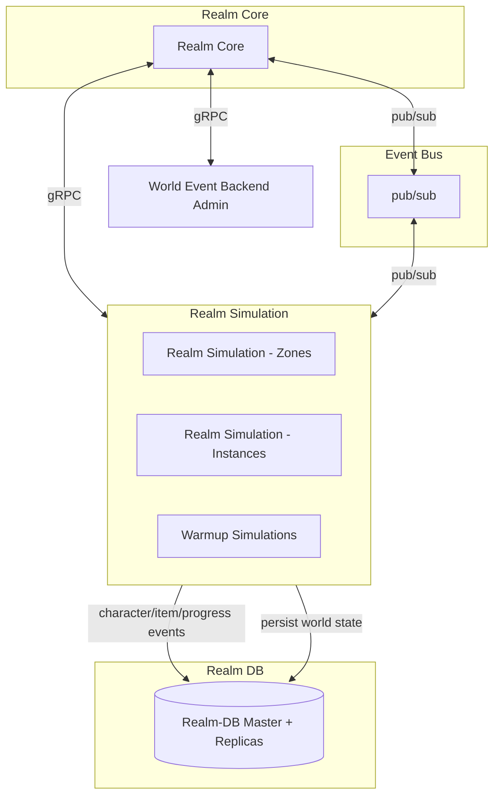
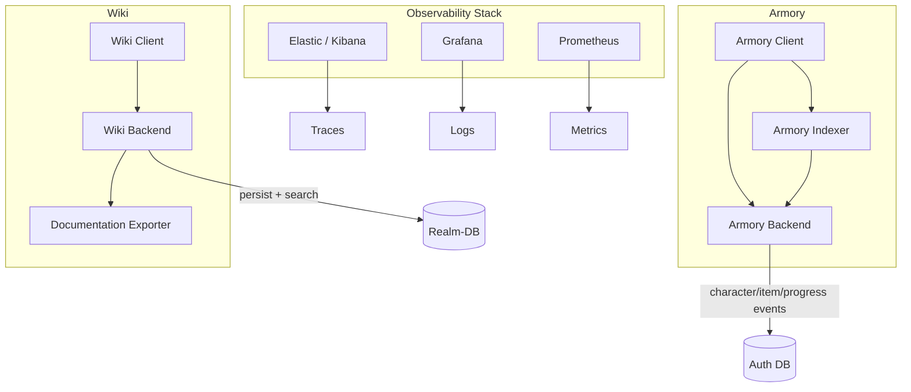

# Architecture

**Related docs:** [Infrastructure](infrastructure.md) (deployment, databases, scaling) · [Current State](game-status.md) (implemented services) · [Current Work](current-work.md) (Event Bus, zone architecture) · [Diagrams](diagrams.md) (sequence diagrams for login, reconnect, layers, Event Bus)

---

## Authority & Simulation

The architecture is built around a clear separation:

**Realm Authority** owns the world state. It is the source of truth. Nothing is committed
without its validation.

**Simulations** propose changes. They run combat, NPC behavior, movement — but they do not
own state. They can be stopped, restarted, or replaced. The authority decides what sticks.

## Realm Model

Each realm is an **isolated, authoritative instance** of the game world.

- Own PostgreSQL database
- Own event stream
- Own simulation workers
- No cross-realm state (by design)

Realms share only:

- Account and authentication (Auth-Backend)
- Static templates: items, classes, NPC definitions (Global-Backend, Armory-Backend)
- Asset delivery (Image-Server)

The corresponding database and deployment layout (Auth DB, Global-DB, Realm-DB per realm) is described in [Infrastructure](infrastructure.md#database-layout) and [Infrastructure](infrastructure.md#realm-isolation).

This isolation enables:

- Horizontal scaling (add realms)
- Fault containment (one realm's failure does not cascade)
- Clean boundaries for testing and deployment

## Service Layout

**Main flow: Ingress → Clients → Auth → Realm Gateway → Global-Backend → Realm Core**

**Realm Core, Event Bus, and Simulations**

**Armory, Wiki, and Observability**

## Communication

- **Synchronous (HTTP/gRPC):** Service-to-service calls. Auth, Realm Gateway, Global-Backend, Realm Core, World Event Backend. See [Current Work](current-work.md) for gRPC Character Service decision and Event Bus exploration.
- **Persistence (SQL):** Auth DB, Global-DB, Realm-DB. Account lookup, world data, character/item/progress events. See [Infrastructure](infrastructure.md#database-layout).
- **Pub/sub (Event Bus):** Realm Core ↔ Realm Simulation. gRPC messages, world state, desired state apply. Event Bus flow is illustrated in [Diagrams](diagrams.md) (sequence-world-event-eventbus).

## Event & State Flow

1. Player action → Gateway (validated) → Realm
2. Realm delegates to appropriate simulation
3. Simulation proposes result → Authority validates → State updated
4. Relevant clients receive updates via WebSocket

The authority never trusts simulation output blindly. It applies rules, checks constraints,
and only then commits. For sequence-level detail (login, reconnect, layer migration, dungeon entry/exit), see [Diagrams](diagrams.md).

## Extracted Components

The project is structured as a **monorepo with shared libraries**. Domain logic that must
be consistent across services lives in separate packages, published internally and
consumed where needed.

**Domain engines**

- A **combat resolution engine**: Hit/miss/crit, damage calculations, stats, equipment.
  Built for determinism and testability. Used by the global backend for battle simulation
  and balance testing.
- A **movement and positioning engine**: Position, facing, movement patterns, range checks.
  Domain-driven design. Used by combat (position in battle) and world entities (NPC/character
  placement).

These engines are **non-authoritative**. They compute outcomes; the realm authority
validates and commits them.

**Shared communication layer**

- Protocol Buffers and gRPC bindings for service-to-service calls: character data, stats,
  inventory, auras, chat, realm snapshots, simulation events. Strong typing, versioned
  contracts.

**Shared observability**

- A logging library with ECS (Elastic Common Schema) format and Elasticsearch integration.
  Used across all backend services for structured, searchable logs.

**Shared tooling**

- TypeScript API client for frontend and admin. Shared ESLint and code quality config
  across the monorepo.

This structure keeps the authority/simulation boundary clear while allowing domain logic
to evolve independently and be tested in isolation. The same stack (Helm, per-realm resources, shared packages) is described from an operations perspective in [Infrastructure](infrastructure.md#component-model).
