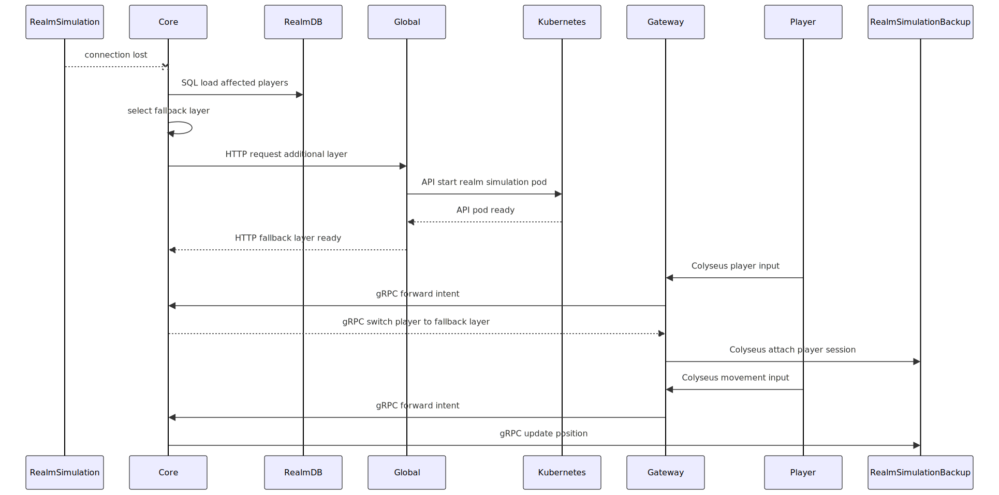
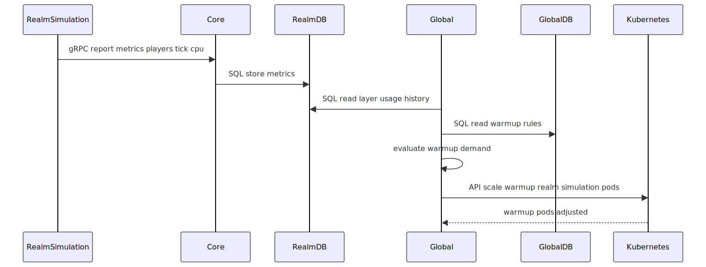
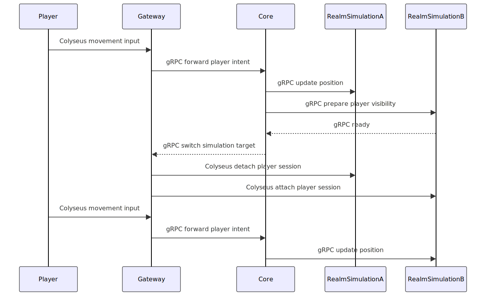
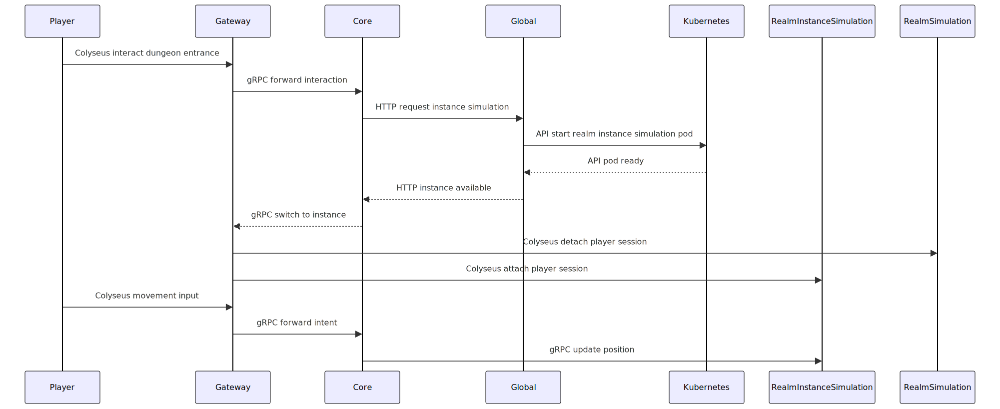

# Sequence Diagrams & Visuals

This page indexes sequence diagrams used in the documentation. **Embedded images** below use the full content width so labels stay legible. If anything still looks small on your screen, **right‑click the diagram → Open image in new tab** (or use the raw `.svg` link under each figure).

Inline **Mermaid** topology charts stay in [Architecture](architecture.md#service-layout) and [Infrastructure](infrastructure.md#stack).

## Index

| Diagram | Description | Referenced in |
|--------|-------------|---------------|
| [Login to gameplay](#login-to-gameplay-session) | Auth, Gateway, Realm, session attach | [Architecture](architecture.md#service-layout), [Infrastructure](infrastructure.md) |
| [Connection lost / fallback](#connection-lost-fallback-layer) | Client disconnect and fallback layer | [Architecture](architecture.md#event--state-flow) |
| [Reconnect / resync](#client-reconnect-state-resync) | Reconnect and state resync | [Architecture](architecture.md#event--state-flow) |
| [Layer migration](#layer-migration) | Layer migration and simulation handover | [Architecture](architecture.md#realm-model), [Current Work](current-work.md) |
| [Layer merge / remove pod](#layer-merge-remove-pod) | Layer merge and simulation pod removal | [Infrastructure](infrastructure.md#scaling-model), [Current Work](current-work.md) |
| [World event / Event Bus](#world-event-event-bus) | World events and Event Bus | [Architecture](architecture.md#communication), [Current Work](current-work.md) |
| [Metrics / warmup / scaling](#metrics-warmup-scaling) | Metrics-driven warmup and scaling | [Infrastructure](infrastructure.md#scaling-model), [Current Work](current-work.md) |
| [Warmup / Tech-Admin](#warmup-tech-admin-configuration) | Tech-Admin warmup configuration | [Infrastructure](infrastructure.md#component-model) |
| [Switch simulation target](#switch-simulation-target) | e.g. zone change | [Architecture](architecture.md#authority--simulation), [Current Work](current-work.md) |
| [Dungeon entry](#dungeon-instance-entry) | Entering a dungeon instance | [Architecture](architecture.md#service-layout), [Current Work](current-work.md) |
| [Dungeon exit](#dungeon-exit-open-world) | Exit instance back to open world | [Architecture](architecture.md#service-layout) |

---

<h3 id="login-to-gameplay-session">Login to gameplay session</h3>

[Raw SVG](images/sequence-login-gameplay-session.svg)

<h3 id="connection-lost-fallback-layer">Connection lost / fallback layer</h3>

[Raw SVG](images/sequence-connection-lost-fallback-layer.svg)

<h3 id="client-reconnect-state-resync">Client reconnect / state resync</h3>

[Raw SVG](images/sequence-client-reconnect-resync.svg)

<h3 id="layer-migration">Layer migration</h3>

[Raw SVG](images/sequence-layer-migration.svg)

<h3 id="layer-merge-remove-pod">Layer merge / remove pod</h3>

[Raw SVG](images/sequence-layer-merge-remove-pod.svg)

<h3 id="world-event-event-bus">World event / Event Bus</h3>

[Raw SVG](images/sequence-world-event-eventbus.svg)

<h3 id="metrics-warmup-scaling">Metrics / warmup / scaling</h3>

[Raw SVG](images/sequence-metrics-warmup-scaling.svg)

<h3 id="warmup-tech-admin-configuration">Warmup / Tech-Admin configuration</h3>

[Raw SVG](images/sequence-warmup-configuration-techadmin.svg)

<h3 id="switch-simulation-target">Switch simulation target</h3>

[Raw SVG](images/sequence-switch-simulation-target.svg)

<h3 id="dungeon-instance-entry">Dungeon instance entry</h3>

[Raw SVG](images/sequence-dungeon-instance-entry.svg)

<h3 id="dungeon-exit-open-world">Dungeon exit / open world</h3>

[Raw SVG](images/sequence-dungeon-exit-open-world.svg)
