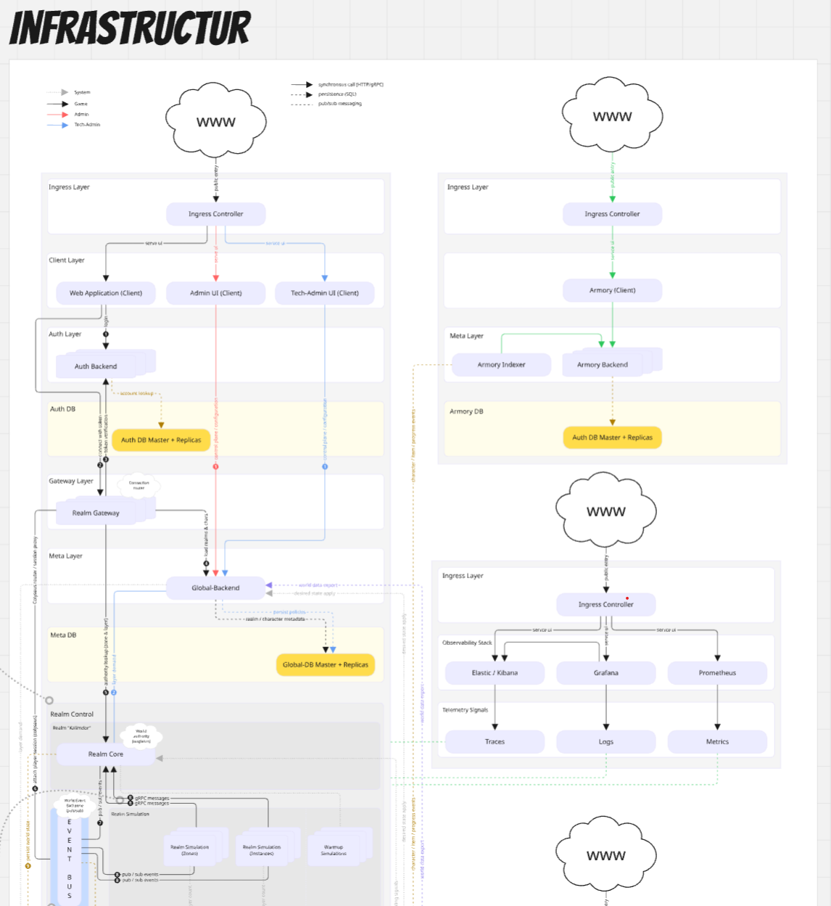

# Infrastructure

**Related docs:** [Architecture](architecture.md) (service layout, realm model, communication) · [Current State](game-status.md) (what is deployed today) · [Current Work](current-work.md) (scaling, Event Bus, observability) · [Diagrams](diagrams.md) (warmup, layer merge, metrics)

Echoes of Order runs on **Kubernetes** (k3s locally), with **Helm** for deployments, **Envoy Gateway** and the **Kubernetes Gateway API** for edge HTTPS routing, **cert-manager** for TLS material, **PostgreSQL** per domain (Auth, Global, Realm), and **Redis** for sessions and cache. Each realm gets its own DB, Event Bus, and simulation pods; scaling is horizontal (more pods) and realm-based (more realms). Below: philosophy, stack, edge routing, database layout, realm isolation, scaling, and component model.

Motivation for Envoy Gateway vs. classic Ingress: [Devlog #1 — Traefik to Envoy Gateway](devlogs/2026-03-devlog-02-traefik-envoy-gateway-migration.md).

## Infrastructure planning workflow (Miro)

I plan infrastructure changes in **Miro** before touching Helm or service code. The board starts with runtime layers (edge, clients, auth, gateway, global, realm, data, observability), then adds concrete services, protocols, and ownership boundaries. This makes coupling visible early and prevents accidental cross-domain assumptions.

The key benefit is dependency discovery before implementation:

- Which component is authoritative for a given state transition
- Which calls are synchronous vs. asynchronous
- Which databases are shared vs. realm-scoped
- Which failure in one layer can cascade into another

By forcing these relationships into one map first, risks become explicit: missing routes, wrong service ownership, hidden bottlenecks, and weak fallback paths. That reduces rework and helps avoid production issues that usually come from architecture drift rather than from isolated code defects.

## Philosophy

Infrastructure is not an afterthought. It is part of the game design.

Echoes of Order runs on Kubernetes because:

- Realms need to scale independently
- Simulations need to be replaceable without downtime
- Failure and recovery must be first-class concerns
- The system must behave correctly under partial failure

## Stack

| Component | Choice | Rationale |
|-----------|--------|-----------|
| Orchestration | Kubernetes (k3s locally) | Pod isolation, scaling, self-healing |
| Package management | Helm | Reproducible, versioned deployments |
| Edge / HTTP(S) | Envoy Gateway + Gateway API | Single config model (Gateway, HTTPRoute); no Ingress annotation mix; GRPCRoute ready for future external gRPC |
| TLS | cert-manager (+ ClusterIssuer) | Certificates for the Gateway listener; app namespace `Secret` name `mkcert-tls` (historic name, works with cert-manager) |
| Databases | PostgreSQL per domain | Auth, global templates, realm state — isolated |
| Caching | Redis | Sessions, cache, pub/sub |
| Observability | Prometheus, Grafana, Elasticsearch, Kibana | Metrics, dashboards, logs |

## Edge traffic (Envoy Gateway)

**Install (cluster):** Envoy Gateway is deployed with the upstream Helm chart (`oci://docker.io/envoyproxy/gateway-helm`) into namespace `envoy-gateway-system`. A **GatewayClass** named `eg` points at controller `gateway.envoyproxy.io/gatewayclass-controller` (manifest under `deployment/k3s/envoy-gateway-gatewayclass.yaml`, applied during k3s setup).

**Gateway resource:** Chart template `echoes-gateway` in the Helm release namespace (e.g. `echoes-dev`). It uses `gatewayClassName: eg`, exposes a single **HTTPS listener on port 443**, terminates TLS with the `mkcert-tls` secret from that namespace, and allows HTTPRoutes from any namespace (`allowedRoutes.namespaces.from: All`).

**Routes:** Public hostnames are backed by **HTTPRoute** objects in the same chart (`templates/httproute/*`) — frontends (game UI, landing, SSO, world authoring), **auth-backend**, **global-backend**, **realm-gateway**, **admin**, **tech-admin**, **wiki**, **image-server**, **armory-backend**, **registry**, **mailpit**, and observability UIs (Grafana, Prometheus, Kibana, Elasticsearch) as needed. There are **no GRPCRoute** resources in the chart today; realm **gRPC stays in-cluster** (e.g. simulations to realm-core). GRPCRoute is reserved for future external gRPC clients.

**Tech-admin:** Lists Gateway API types (Gateways, HTTPRoutes, GRPCRoutes) instead of legacy Ingress.

**Local access (WSL2 / dev):** The managed Envoy **Service** may only expose **443** (no HTTP 80 listener on the Gateway). On the WSL2 host, `envoy-gateway-forward` runs `kubectl port-forward` to that Service so `https://*.eoo.local` resolves via hosts file to localhost. See `scripts/start-envoy-gateway-forward.sh` and `deployment/k3s/envoy-gateway-forward.service`. Alternatively hit the Service’s LoadBalancer IP with the correct `Host` header.

## Database Layout

- **Auth DB** (Master + Replicas): Account lookup, character/item/progress events (Armory). Used by Auth Backend and Armory; see [Architecture](architecture.md#service-layout) for the request flow.
- **Global-DB** (Master + Replicas): World data export, realm/character metadata. Feeds Global-Backend and realm/character index; see [Architecture](architecture.md#realm-model) for what realms share.
- **Realm-DB** (Master + Replicas): Character events, player count, login history, world state, wiki persist + search. One per realm; see [Realm Isolation](#realm-isolation) below.
- **Image-Server DB** (Master + Replicas): Asset metadata for the image service.
- **World-Authoring DB** (Master + Replicas): Persistence for the world-authoring backend (lore/tooling); separate from realm gameplay databases.

## Realm Isolation

Each realm gets:

- Dedicated Realm-DB instance (or schema)
- Own Event Bus for pub/sub between Realm Core and Realm Simulation
- Own simulation pods (Zones, Instances, Warmup)
- Own HTTPRoutes or Gateway attachments if a realm needs extra host exposure

Shared services (Auth, Global, Armory, Wiki) are stateless where possible and scoped by realm ID where not. The logical split between realm-owned and shared is described in [Architecture](architecture.md#realm-model).

## Scaling Model

**Horizontal:** More pods per service. Realm-Gateway, simulations, and workers scale out.

**Realm-based:** Add new realm deployments. Each is independent. No shared realm state.

**Database:** Connection pooling, read replicas for heavy query paths. Per-realm DBs avoid cross-realm contention. For layer merge and warmup-driven scaling, see [Diagrams](diagrams.md) (layer-merge-remove-pod, metrics-warmup-scaling).

## What This Enables

- **Rolling updates:** Zero-downtime deploys. Simulations can be swapped out.
- **Failure recovery:** Pods restart. Realm state persists. Simulations reconnect.
- **Scaling:** Add realms or add pods. The architecture does not change.
- **Observability:** Every service exposes metrics. Logs aggregate. Debugging is possible.

Infrastructure is not "just ops." It is the substrate that makes authority and simulation possible.

## Component Model

The system is built from **shared packages** consumed by multiple services:

- Domain engines (combat, movement) as internal libraries
- Typed gRPC contracts for service boundaries
- Centralized logging for observability
- Shared API client and tooling

This reduces duplication, enforces consistency, and makes it clear which code owns what. For the same component view from an authority/simulation perspective, see [Architecture](architecture.md#extracted-components).
